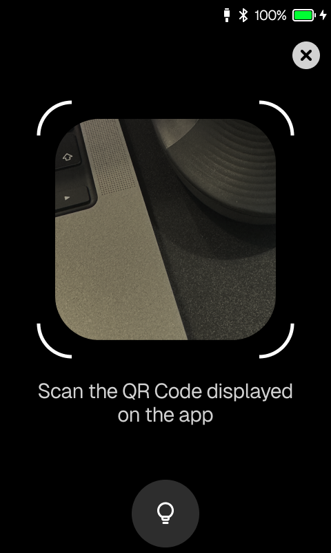
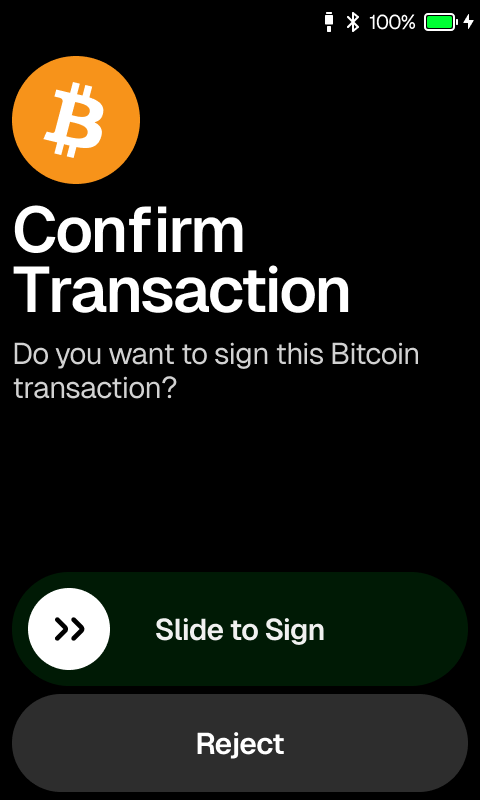

# Tutorial: Wallet Integration

## Integration

If using the OneKey device via air gap mode, the main steps are as follows:

* OneKey hardware provides the extened public key to the wallet via a QR code, then the wallet generates an address to query balance and other information.
* The wallet creates unsigned transaction data or a message that needs to be signed, then generates a QR code. The OneKey device scans the QR code to receive the content that needs to be signed.
* The OneKey device will parse and sign the data, then display the result through a QR code.
* The wallet obtains the signed result by scanning the QR code from the OneKey device.

## &#x20;Install SDK

First, we need to install the SDK for air gap.

<pre class="language-shell"><code class="lang-shell"><strong># Install via NPM
</strong>npm install --save @onekeyfe/hd-air-gap-sdk

# Install via YARN
yarn add @onekeyfe/hd-air-gap-sdk
</code></pre>


## Add Hardware Account To Wallet

Then, we need to add the hardware account to the software.

<table data-view="cards"><thead><tr><th></th></tr></thead><tbody><tr><td></td></tr><tr><td></td></tr><tr><td></td></tr></tbody></table>


Through the steps above, you will obtain a QR code. Parsing this QR code with software will give you an extended public key, which can then be used to derive the respective addresses.


### Scan QR Code

* First, your software needs to be capable of scanning QR codes to retrieve the information they contain.
* Sometimes, the data to be transferred can be very large, and a single QR code may not be able to display all the required data at once. Therefore, it may need to continuously switch between different QR codes dynamically to transfer all the data.

```typescript
import { URDecoder } from '@onekeyfe/hd-air-gap-sdk';

// A new urDecoder object is needed for each QR code parsing session.
const urDecoder = new URDecoder();

const onQrcodeScan = (data: string) => {
  try {
    if (!data) {
      return;
    }
    // Each piece of scanned data is parsed using urDecoder.
    urDecoder.receivePart(data);
    
    // Obtain the data reception progress.
    urDecoder.estimatedPercentComplete();
    
    // Check whether all data has been completely received.
    if (urDecoder.isComplete()) {
      const result = urDecoder.resultUR();
      // At this point, result contains the data received, including the data type and the specific data.
    }
  } catch (e) {
    console.log(e);
  }
}

<CameraView onBarcodeScanned={({ data }) => onQrcodeScan(data)} />
```


### Parse Account Data

Through the steps above, we have obtained the account information. Next, we can parse the data and derive the account.

```typescript
import { CryptoHDKey, RegistryTypes } from '@onekeyfe/hd-air-gap-sdk';

import HDKey from "hdkey";
import {
  toChecksumAddress,
  publicToAddress,
  stripHexPrefix,
} from "@ethereumjs/util";
const DEFAULT_CHILDREN_PATH = "0/*";

// pseudo-code
const result = urDecoder.resultUR();

if (result.type !== RegistryTypes.CRYPTO_HDKEY.getType()) {
    // error qr code
}

const cryptoHDKey = CryptoHDKey.fromCBOR(result.cbor);

const name = cryptoHDKey.getName();
const note = cryptoHDKey.getNote();

const extendPubKey = hdKey.getKey();
const chainCode = hdKey.getChainCode();

const xpub = hdKey.getBip32Key();
const childrenPath = hdKey.getChildren()?.getPath() ?? DEFAULT_CHILDREN_PATH;
const hdPath = `m/${cryptoHDKey.getOrigin().getPath()}`;
// This parameter is required for subsequent eth sign request assembly.
const xfp = cryptoHDKey.getOrigin().getSourceFingerprint()?.toString("hex");

// derive child
const accountIndex = 0
const derivePath = childrenPath
        .replace("*", String(accountIndex))
        .replace(/\*/g, "0");

const hdk = HDKey.fromExtendedKey(xpub);
const dkey = hdk.derive(`m/${derivePath}`);
const address =
        "0x" + publicToAddress(dkey.publicKey, true).toString("hex");
const addressWithChecksum = toChecksumAddress(address);

console.log("address:", addressWithChecksum);
```


For more details, you can refer to the documentation below.


[cryptohdkey.md](api-reference/basic-api/cryptohdkey.md)



## Reqeust Sign

> For example, with ETH.

* The first step requires the wallet to generate the transaction that needs to be signed.
* The unsigned transaction needs to be converted into a QR code for the OneKey device to scan.
* After signing, the OneKey device displays a QR code. The wallet scans the QR code on the device to obtain the signed result.


### Generate transaction

```typescript
import { Transaction, FeeMarketEIP1559Transaction } from '@ethereumjs/tx';
import Common, { Hardfork } from '@ethereumjs/common';
import { BN } from 'ethereumjs-util';
import * as uuid from "uuid";

import {
    CryptoHDKey,
    EthSignRequest,
    DataType,
    ETHSignature,
} from '@onekeyfe/hd-air-gap-sdk';

const common = Common.forCustomChain('mainnet', { chainId: this._networkId }, Hardfork.London);
const eip1559Tx = FeeMarketEIP1559Transaction.fromTxData(txParams, { common });
// generate the unsigned transaction bytes
const unsignedBuffer = Buffer.from(eip1559Tx.getMessageToSign(false));
const requestId = uuid.v4();

const addressPath = "m/44'/60'/0'/0/0"

const ethSignRequest = EthSignRequest.constructETHRequest(
    unsignedBuffer,
    DataType.typedTransaction, // legacy transaction use DataType.transaction
    addressPath,
    xfp, // See Previous Step How do I get this parameter
    requestId,
    1, // chainId
    "from address",
);

// each chunk Number in single QR Code
const maxChunkNumber = 200;

// get the ur encoder
const urEncoder = ethSignRequest.toUREncoder(maxChunkNumber);

while (ture) {
    delay(200);
    renderQR(urEncoder.nextPart());
}

```

For more details, you can refer to the documentation below.


[ethsignrequest.md](api-reference/ethereum-and-evm/ethsignrequest.md)



### Hardware processing signature

<table data-view="cards"><thead><tr><th></th></tr></thead><tbody><tr><td></td></tr><tr><td></td></tr><tr><td></td></tr><tr><td></td></tr></tbody></table>


### Parse Signature result

Decode QR Code See [#scan-qr-code](tutorial-wallet-integration.md#scan-qr-code "mention")

```typescript
import { CryptoHDKey, RegistryTypes } from '@onekeyfe/hd-air-gap-sdk';
import { Transaction } from '@ethereumjs/tx';

// pseudo-code
const result = urDecoder.resultUR();

if (result.type !== RegistryTypes.ETH_SIGNATURE.getType()) {
    // Invalid QR code type
}

const ethSignature = ETHSignature.fromCBOR(result.cbor);

// Extract the request ID, signature
const requestIdBuffer = ethSignature.getRequestId();
const signature = ethSignature.getSignature();

// its components (r, s, v) from the decoded signature
const r = signature.slice(0, 32);
const s = signature.slice(32, 64);
const v = signature.slice(64);


// Assuming you have the transaction details and the signature components
const txData = {
    nonce: '0x00',
    gasPrice: '0x09184e72a000',
    gasLimit: '0x2710',
    to: '0x0000000000000000000000000000000000000000',
    value: '0x00',
    data: '0x00',
    // Add the signature components to the transaction data
    v: v,
    r: r,
    s: s
};

// Create a new transaction object with the provided data
const transaction = Transaction.fromTxData(txData);

// Serialize the transaction to get the raw transaction
const rawTx = transaction.serialize();

// The raw transaction can now be submitted to the blockchain network
console.log("Raw transaction:", rawTx.toString('hex'));
```

For more details, you can refer to the documentation below.


[ethsignature.md](api-reference/ethereum-and-evm/ethsignature.md)


