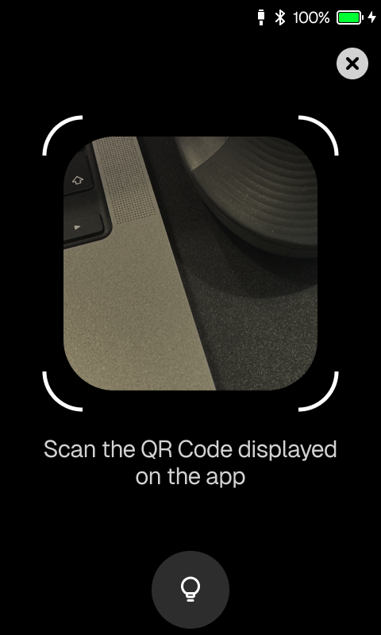
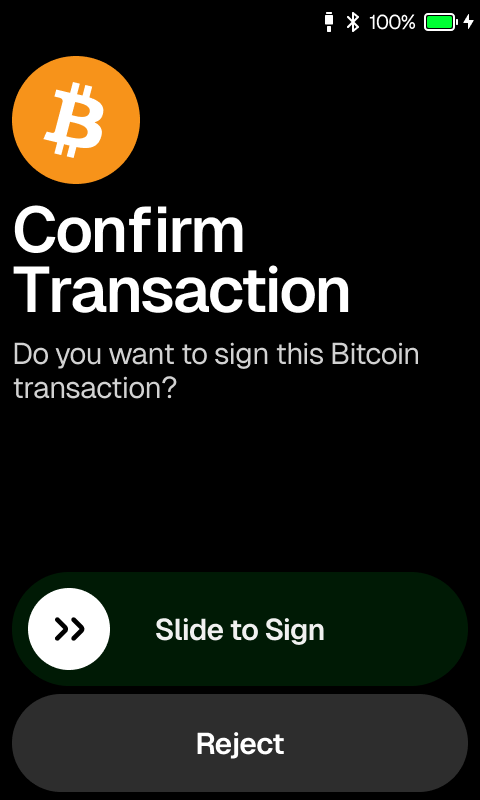

# Wallet Integration

## &#x20;Install SDK

<pre class="language-shell"><code class="lang-shell"><strong># Install via NPM
</strong>npm install --save @onekeyfe/hd-air-gap-sdk

# Install via YARN
yarn add @onekeyfe/hd-air-gap-sdk
</code></pre>

## Integration

To use it with OneKey, follow these steps:

* OneKey provides the public key to the wallet via a QR code, then the wallet generates an address to query balance and other information.
* The wallet creates unsigned transaction data or a message that needs to be signed, then generates a QR code. The OneKey device scans the QR code to receive the content that needs to be signed.
* The OneKey device will parse and sign the data, then display the result through a QR code.
* The wallet obtains the signed result by scanning the QR code from the OneKey device.

### Add Wallet

The OneKey device displays a connection QR code. The wallet decodes the QR code to obtain the corresponding extened public key, which can then be used to derive the respective addresses.&#x20;

For the parsing method and format. Please refer to the documentation.


[cryptohdkey.md](api-reference/basic-api/cryptohdkey.md)


<table data-view="cards"><thead><tr><th></th></tr></thead><tbody><tr><td></td></tr><tr><td></td></tr><tr><td></td></tr></tbody></table>

### Signature

> For example, with ETH.

* The first step requires the wallet to generate the transaction that needs to be signed.
* The unsigned transaction needs to be converted into a QR code for the OneKey device to scan.
* After signing, the OneKey device displays a QR code. The wallet scans the QR code on the device to obtain the signed result.

The wallet assemble the request to sign a QR code.


[ethsignrequest.md](api-reference/ethereum-and-evm/ethsignrequest.md)


The Wallet parse the signature result from the hardware.


[ethsignature.md](api-reference/ethereum-and-evm/ethsignature.md)


<table data-view="cards"><thead><tr><th></th></tr></thead><tbody><tr><td></td></tr><tr><td></td></tr><tr><td></td></tr><tr><td></td></tr></tbody></table>

